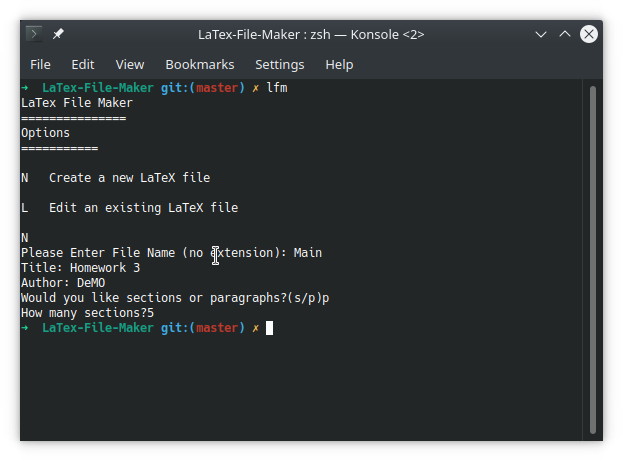
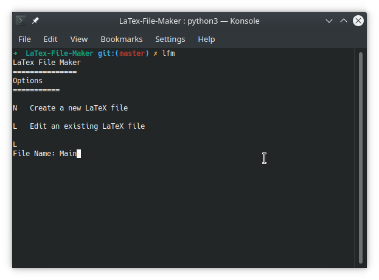
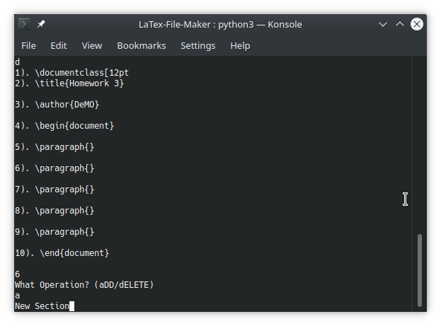
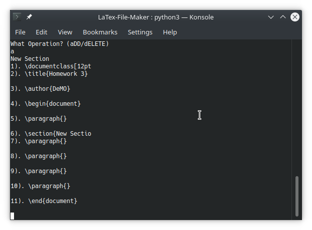

# LaTeX File Maker
A python program/library to create and edit individual `tex` files.

## Requirements
- Python 3.X

## Installation
This program has yet to have an automated installation process,
however it can be added to a bash session by using an alias:
```
$ alias lfm="python3 ~/Path/To/File/LatexTemplate.py 
```

This can be added to your `.bashrc` or `.bash_aliases` for pesistent use.
## How to use?
Launch the program


### Create
1. Press `N` then enter.
2. Enter a filename without an extension.
3. Enter a title.
4. Enter author name.
5. Enter s or p for sections or paragraphs respectively.
6. Enter number of sections.




### Load
Note: The program makes a backup file.
1. Press `L` then enter.
2. Enter file name without an extension.




#### Add Section
3. Select an element where you want insert a
section at by entering its corresponding number
4. Press `a`, then enter.
5. Enter a name for the section.






#### Delete Section
3. Select an element that you want to delete by entering its corresponding number.


4. Press `d` then enter.


### Output exmaple
This is from after a section was inserted via the program.


## Planned Features
- Add editing existing sections
- Single line operation `python3 LatexTemplate.py -a DeMO -s {p,p,p, s "Some Section"}`
- Implement parsing (some data classes exist)
